# Sogrom's Table Tools: GM Guide

This guide is for the GM. It covers setting Sogrom's Table Tools up, the settings, and asking the table for rolls. What players
see and do, including how the Hero Cards work, is in the [player guide](README.md). Read that first: as GM you
can do everything a player can.

## Contents

- [Setting up](#setting-up)
- [Settings](#settings)
- [Asking for rolls](#asking-for-rolls)
  - [The request window](#the-request-window)
  - [Kinds of request](#kinds-of-request)
  - [Running a request](#running-a-request)
  - [Who can roll, and rolling again](#who-can-roll-and-rolling-again)
  - [Private rolls and what "hidden" means](#private-rolls-and-what-hidden-means)
  - [Pop-ups](#pop-ups)
- [Cards and dice at the table](#cards-and-dice-at-the-table)
- [Macros](#macros)

## Setting up

1. **Install.** In Foundry's setup screen, go to **Add-on Modules → Install Module**. Search for "Sogrom's Table Tools" or paste
   the manifest URL:
   `https://github.com/IainFielding/RoBear-5-Foundry-VTT-Module/releases/latest/download/module.json`
2. **Enable** Sogrom's Table Tools in your world's **Manage Modules**. It needs Foundry VTT v14 and D&D 5e 6.x (tested on 6.0.5).
3. **Give out the cards.** Drag the **Hero Cards** feature from the **Items (Sogrom's Table Tools)** compendium onto each
   character who should have them. Each card is an activity on that feature with one use, recovered on a long rest.
   To give a card back early, reset its uses on the character sheet.

The compendiums sit in a **Sogrom's Table Tools** folder in the Compendium sidebar. Players can view them.

| Compendium | What's in it |
|---|---|
| **Journal (Sogrom's Table Tools)** | **Artwork**: the art of every card, and the campaign art. **Spell Lists**: a class spell list for each spellcasting class, registered with D&D 5e. |
| **Items (Sogrom's Table Tools)** | The **Hero Cards** feature, the **Belts of Phoenix Dexterity**, and **Corn Liquor**. |
| **Spells (Sogrom's Table Tools)** | **Theodore's Morning Coffee**. |

## Settings

Find these in **Game Settings → Configure Settings → Sogrom's Table Tools**. Each one applies to the whole world.

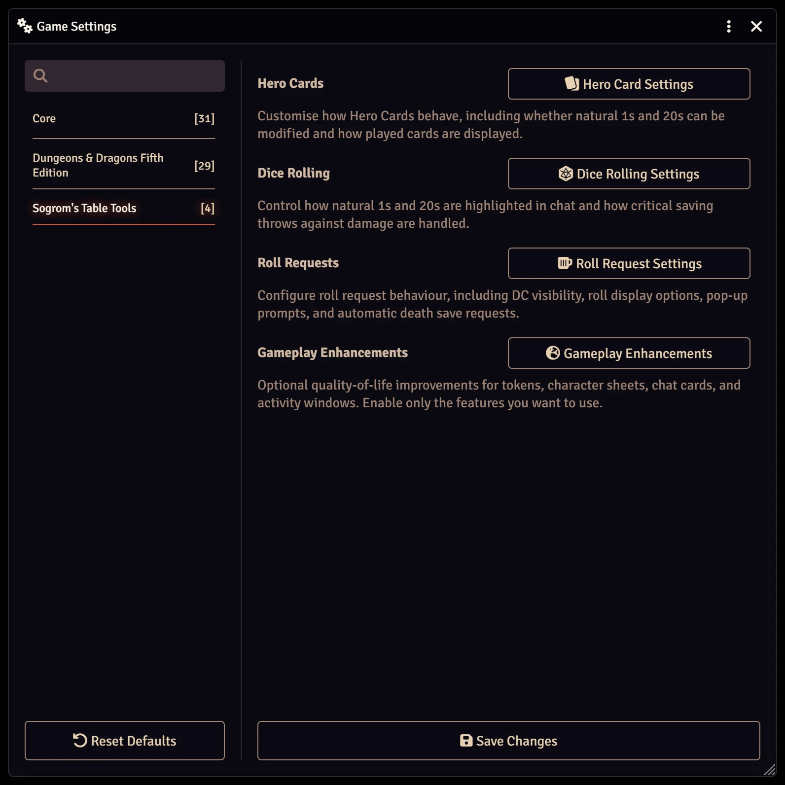

| Setting | Default | What it does |
|---|---|---|
| **Natural 1s and 20s lock Hero Cards** | On | No card can be played on a roll whose d20 shows a natural 1 or 20. Turn it off to allow Advantage and Inspiration on them. Either way, Luck can't be played on a natural 20, and nothing rerolls a natural 1. |
| **Natural 1s and 20s on saves against damage** | On | When a spell or feature calls for a save and deals damage, a natural 20 on the save takes no damage, and a natural 1 takes the damage's maximum, every die at its highest (36 from 6d6), ignoring resistances and immunities. Each starts that way in the damage's **Apply** tray, where you can still change it. Turn it off for D&D 5e's own rules. |
| **Ring natural 1s and 20s** | On | A roll whose d20 shows a natural 20 is ringed in gold in chat, and a natural 1 in red: checks, saving throws and attacks, a save summarised inside the card of the spell that called for it, and a result on a request card. Turn it off for plain totals. |
| **Show played cards on screen** | On | A played card's art appears in the middle of the screen for everyone who can see the roll. Chat keeps a record either way. |
| **Show the DC to players by default** | Off | Whether **Show DC to Players** starts ticked in the request window. You can still change it for each request. |
| **Attach rolls to the request card** | On | The rolls made for a request show on its card rather than as messages of their own, as D&D 5e does for an item's saves. Click a result to see its dice. |
| **Pop up roll requests for players** | Off | Opens a window for each player with a character in a request, with a Roll button for each of their characters. |
| **Pop up roll requests for the GM** | Off | Opens a window for you when a request includes NPCs, or any actor no player owns. |

## Asking for rolls

Open the request window from the **anchor** button in the chat controls, under the chat log:


When the chat sidebar is closed, use **Request Rolls** in the token controls instead. Only a GM sees these
buttons.

### The request window


1. **Kind of roll.** Pick one of the six kinds described below. The fields below change to suit it, and anything
   you've filled in carries over when you switch.
2. **Rolls.** Choose the roll: a plain die (a d20 by default, or a d6, d8, d10, d12 or d100), any skill or tool check,
   ability check, or saving throw. Then set the DC, or leave it blank for none.
3. **Who rolls.** The actors of any tokens you have selected are ticked for you; otherwise the player characters
   are. The list offers the selected tokens, the player characters, and the tokens on the current scene. The tick
   button beside the heading selects them all.
4. **Options.**
   - **Show DC to Players.** Unticked, players see "DC ?" on the card, and the DC is kept off their rolls so D&D 5e
     doesn't show them success or failure.
   - **Roll Visibility.** **Public**, or **Private GM Roll**, where each player sees only their own results.
5. **Send Request** posts the request to chat.

**Offering a choice of rolls.** In a Standard Roll, Team Challenge or Skill Challenge, click **+** beside a roll to
let each actor make a different roll instead, such as Athletics or Acrobatics, or Persuasion or Deception. You can
offer up to four rolls. When a player clicks **Roll**, they're asked which one to make. Hover over a result on the card
to see which they chose.

In a Standard Roll or Skill Challenge, each choice has a DC of its own, so an easier roll can have a harder DC: for
example, Athletics at DC 15 or Acrobatics at DC 10. A new choice starts with the roll's DC. In a Team Challenge,
the choices share one DC, because the rolls are averaged against it.

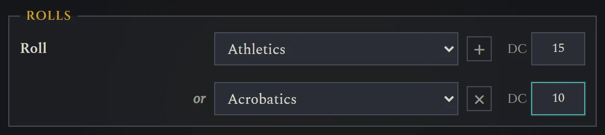

The card lists each choice with its DC, and you can click any of them to change it. Players see each DC on the card
and on the buttons they choose from, or "DC ?" if you're keeping the DC hidden.

### Kinds of request

#### Standard Roll

Each actor rolls once against the DC. You see straight away who passed and how many succeeded. Players don't, until
you click **Show to players**, and you can hide it again.

<table>
<tr><th>What you see</th><th>What players see</th></tr>
<tr>
<td>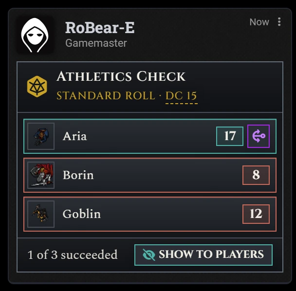</td>
<td>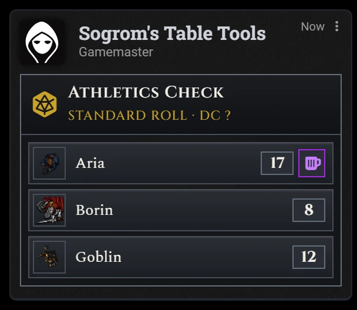</td>
</tr>
</table>

Once you show it:

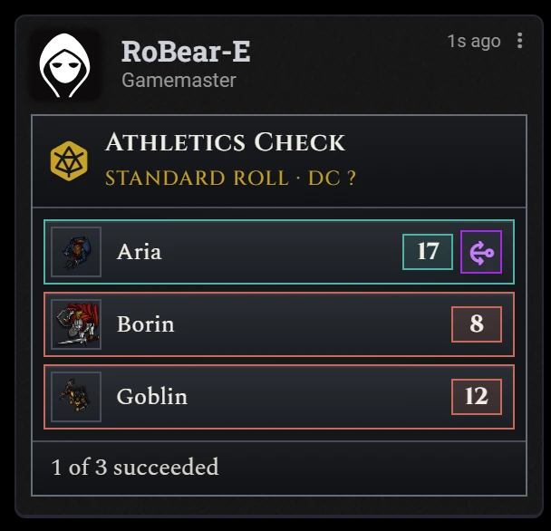

#### Skill Challenge

Three rolls in turn, each with its own roll and DC. Choose how many successes are needed (2 of 3 by default). An
actor stops rolling as soon as they have passed or failed. Only you see who passed until you click **Show to
players**; players see "Done" once they have finished.

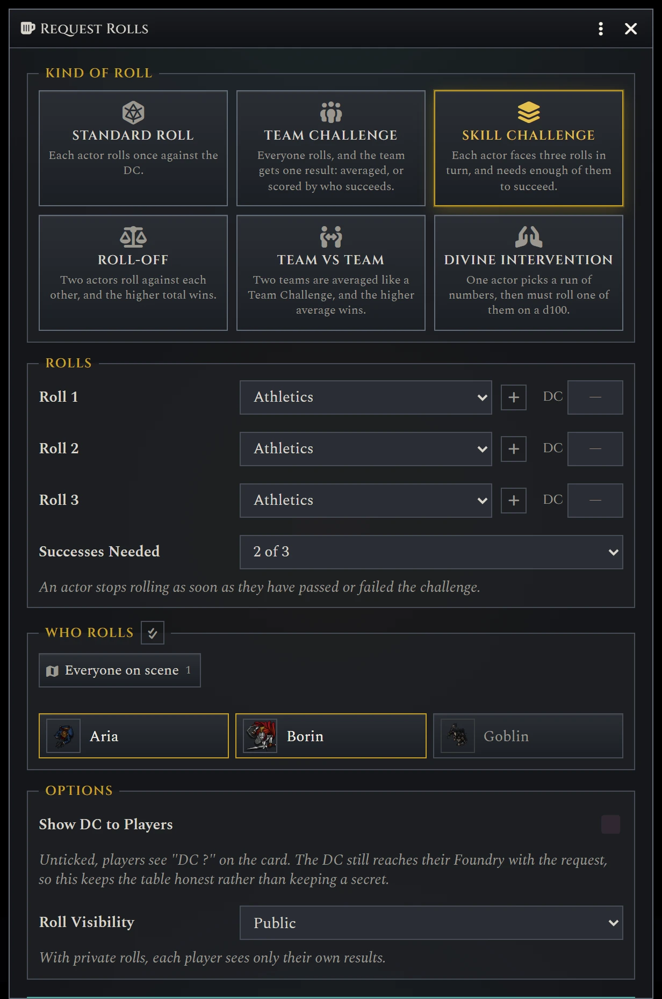


#### Team Challenge

Everyone rolls, and the average, rounded down, is compared to the DC. Each natural 1 removes the highest roll from
the pool, and each natural 20 removes the lowest. If that would leave no rolls, 1s and 20s cancel out in pairs, and at
least one roll always stays. Hover over a removed roll to see why it was removed. Only you see the result until you
click **Show to players**.

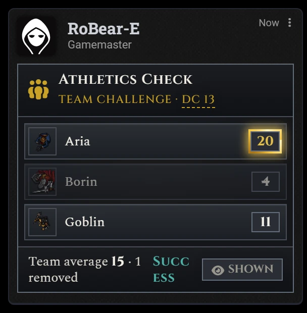

#### Roll-Off

One actor against another, player characters or NPCs. Pick a **Challenger** and an **Opponent**, and a roll for each:
a d20 (the default), a d6, d8, d10, d12 or d100, or any check, save or tool. The higher total wins; an equal total is a
tie.

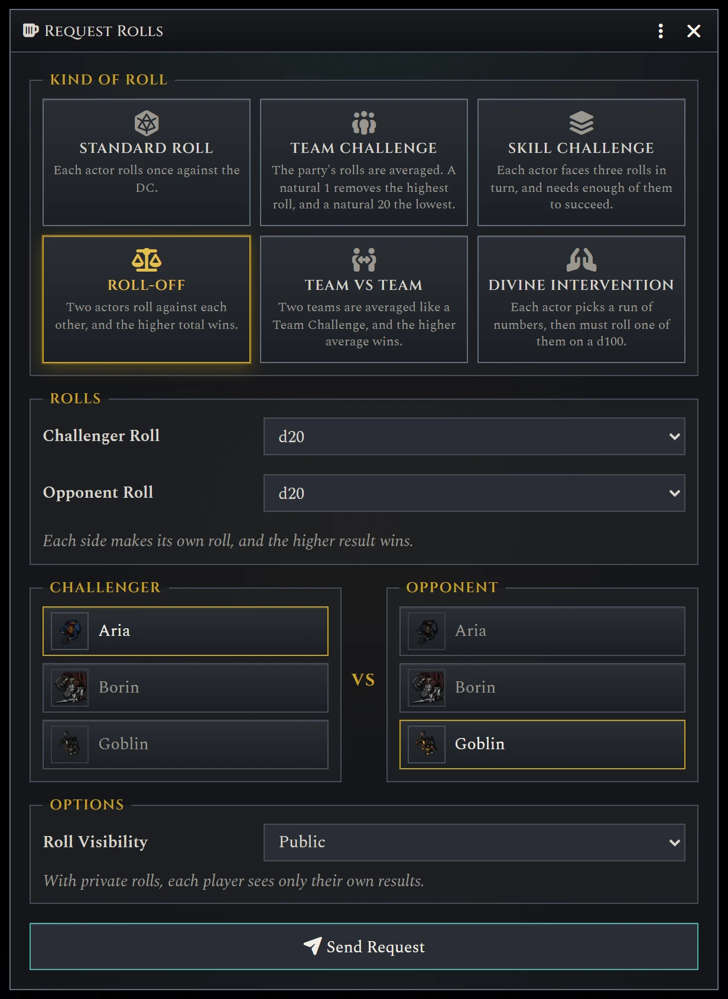

An NPC's roll is a private GM roll: players see "?" until you click **Show NPC roll** on the card, and you can hide it
again.

<table>
<tr><th>What you see</th><th>What players see</th></tr>
<tr>
<td>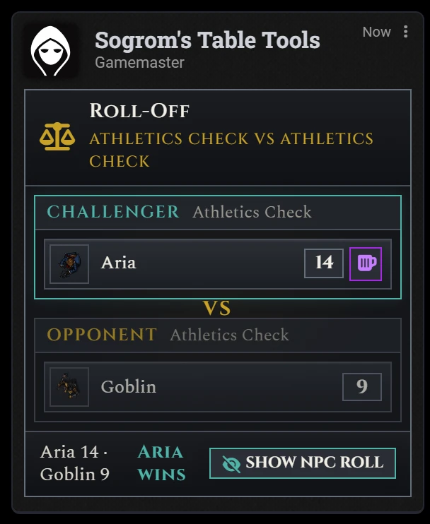</td>
<td>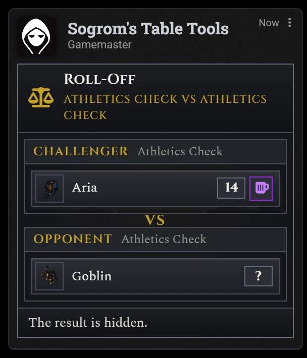</td>
</tr>
</table>

#### Team vs Team

Pick a **Players** team and an **NPCs** team, and a roll for each (a d20 by default, or any check, save or tool). Each
team's rolls are pooled like a Team Challenge, natural 1s and 20s included, and the higher average wins.

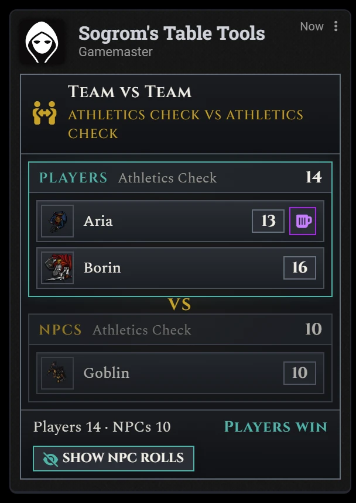

#### Divine Intervention

Set how many numbers each player picks, from 1 to 50 (16 by default). When a player clicks **Roll**, they pick that
many numbers in a row from 1 to 100, then roll a d100, and must roll one of their numbers. The **Advantage** card
rolls a second d100 and keeps whichever lands in their numbers, and **Luck** rerolls the d100.

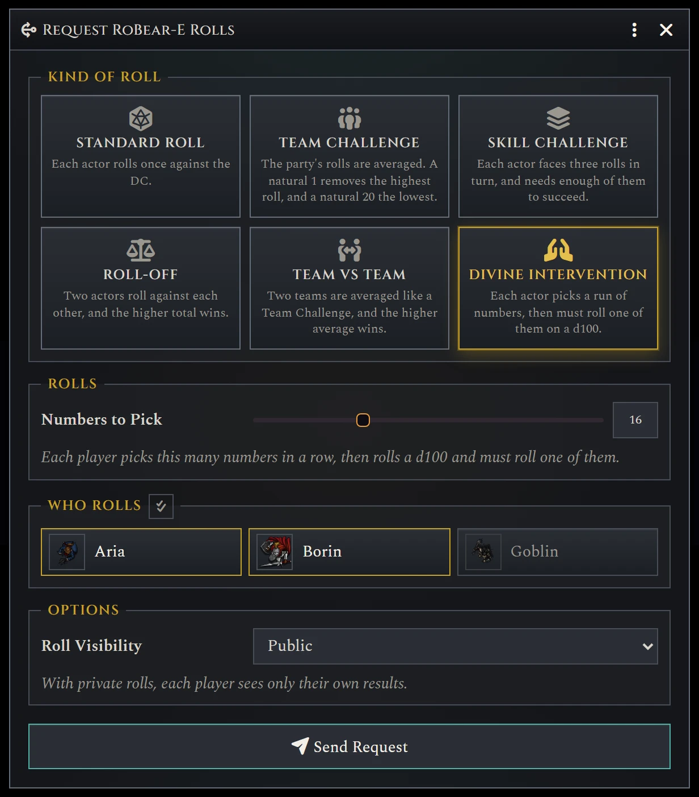

### Running a request

**Rolling for NPCs.** Every row has a **Roll** button for you, so you can roll for anyone, including NPCs.

**Changing the DC.** On a Standard Roll, Team Challenge or Skill Challenge card, click the DC to change it, or clear
it for no DC (each Skill Challenge roll must keep one). Where each choice has its own DC, click the one to change.
Rolls already made are scored again against the new DC.

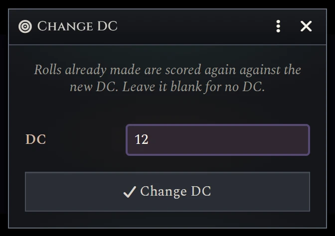

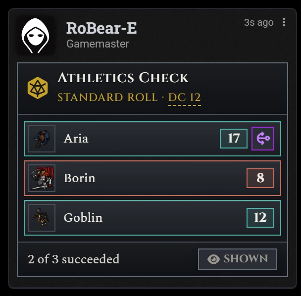

**Cards on requested rolls.** Requested rolls are ordinary D&D 5e rolls, so players can play Hero Cards on them,
from the anchor button beside their result. The card updates as soon as a card changes a roll.

**Attached rolls.** With **Attach rolls to the request card** on (the default), the rolls don't get chat messages of
their own. Click a result to see its dice. Notes on any cards played show under the row.

### Who can roll, and rolling again

- A roll only counts if it was made by you or by one of the actor's owners.
- If the same roll is made twice, such as by you and a player clicking **Roll** at the same moment, the first one
  counts.
- **To let someone roll again,** click their result on the card to open its dice, then click **Roll again** and
  confirm. Their roll is deleted and their **Roll** button comes back. A card played on that roll stays spent. With
  **Attach rolls to the request card** off, you can also delete the roll's own chat message. Players can't delete a
  roll made for a request, so they can't throw away a bad roll.

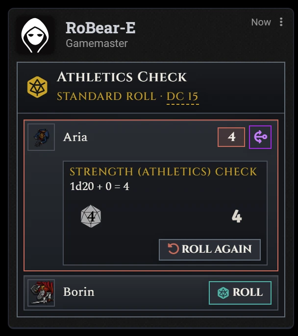

### Private rolls and what "hidden" means

- With **Private GM Roll**, each player sees only their own results. In a private Roll-Off, **Show NPC roll** shows the
  NPC's roll only to the players in the request, not to everyone.
- **Hidden isn't secret.** The DC, and results you haven't shown yet, are hidden on the chat card, but they still
  reach every player's Foundry as part of the request. A player who opens the browser console can read them. That's
  how Foundry shares chat messages, so the hiding keeps the table honest rather than keeping a secret.

### Pop-ups

Two settings, both off by default, open a window when a request is posted:

- **Pop up roll requests for players** gives each player a window with a **Roll** button for each of their
  characters in the request. A player who joins within 30 minutes of a request they still need to roll for gets its
  window then.
- **Pop up roll requests for the GM** does the same for you, for NPCs and any other actor no player owns.

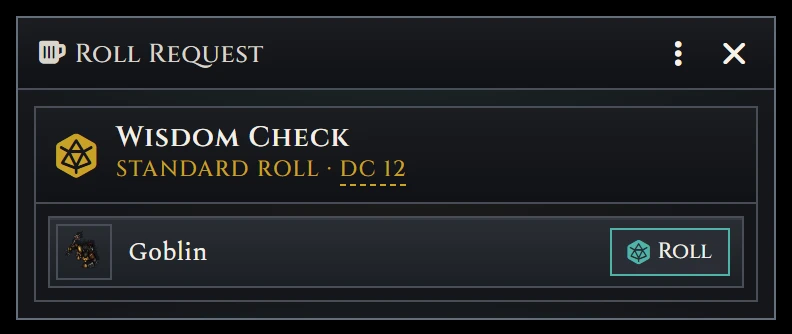

Each window closes once everything in it is rolled. The chat card works either way.

## Cards and dice at the table

- **You can play cards for players.** As GM you can open the card chooser on any roll by a character who holds
  Hero Cards, and play one for them.
- **Bonus dice need a GM online.** When a player adds a die such as Bardic Inspiration to a roll that isn't theirs,
  such as a monster's roll for Cutting Words, your Foundry makes the change. If no GM is logged in, or your Foundry
  can't make it, the player is told and the die isn't spent.
- **Indomitable waits for you.** On a request whose result you haven't shown, Indomitable (the card or the Fighter
  feature) is only offered once you click **Show to players**, so it doesn't give away who failed.
- **Natural 1s and 20s.** The lock is a world setting: see [Settings](#settings).

## Macros

A macro can open the request window, or post a request without it:

```js
const tools = game.modules.get("sogrom-table-tools").api;

// Open the request window, as the anchor button does.
tools.requestRolls();

// Ask the party's player characters for a DC 15 Athletics check.
const party = game.actors.filter(a => a.hasPlayerOwner && (a.type === "character"));
await tools.createRequest({
  mode: "standard",
  parts: [{ type: "skill", key: "ath", dc: 15 }],
  actors: party.map(a => a.uuid)
});
```

Anything the macro leaves out is filled in as the window would fill it. A request that can't be rolled, such as one
naming a skill D&D 5e doesn't know, is refused with a message saying why. The
[Developer Guide](DEVELOPER.md#the-api) describes every option, with an example for each kind of request.
