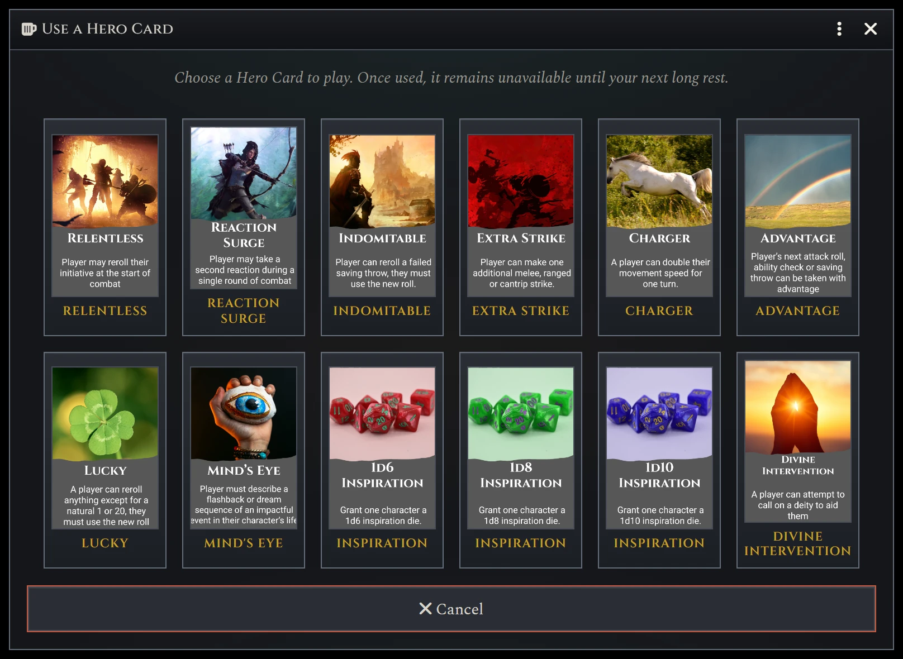
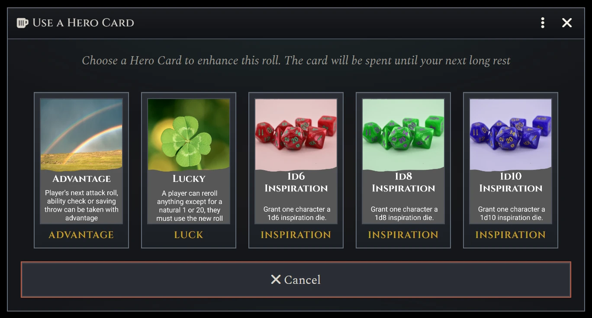
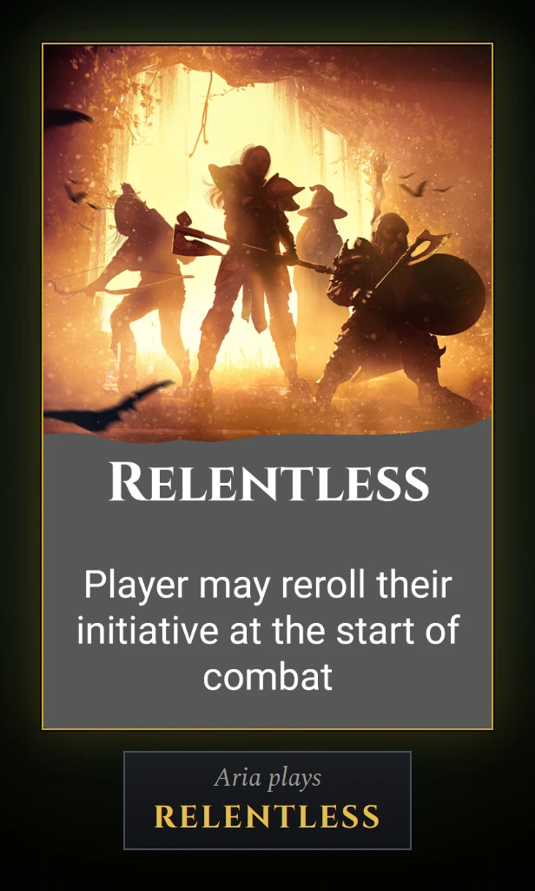
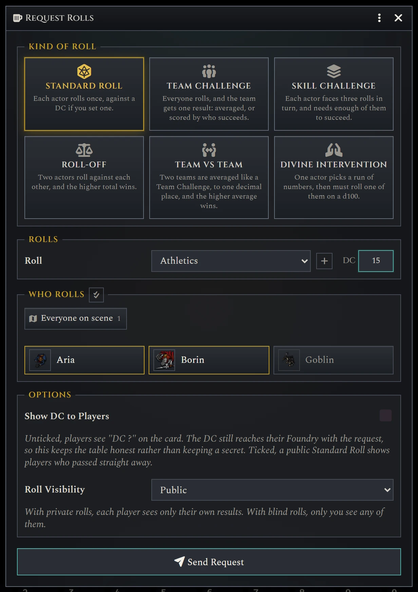
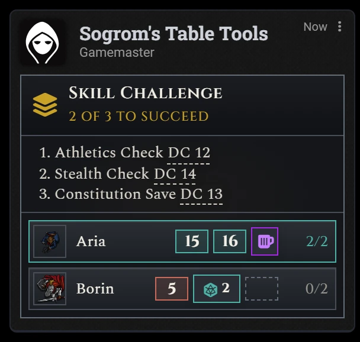
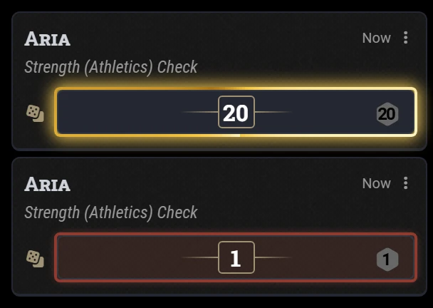
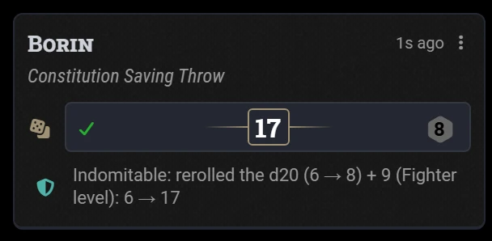
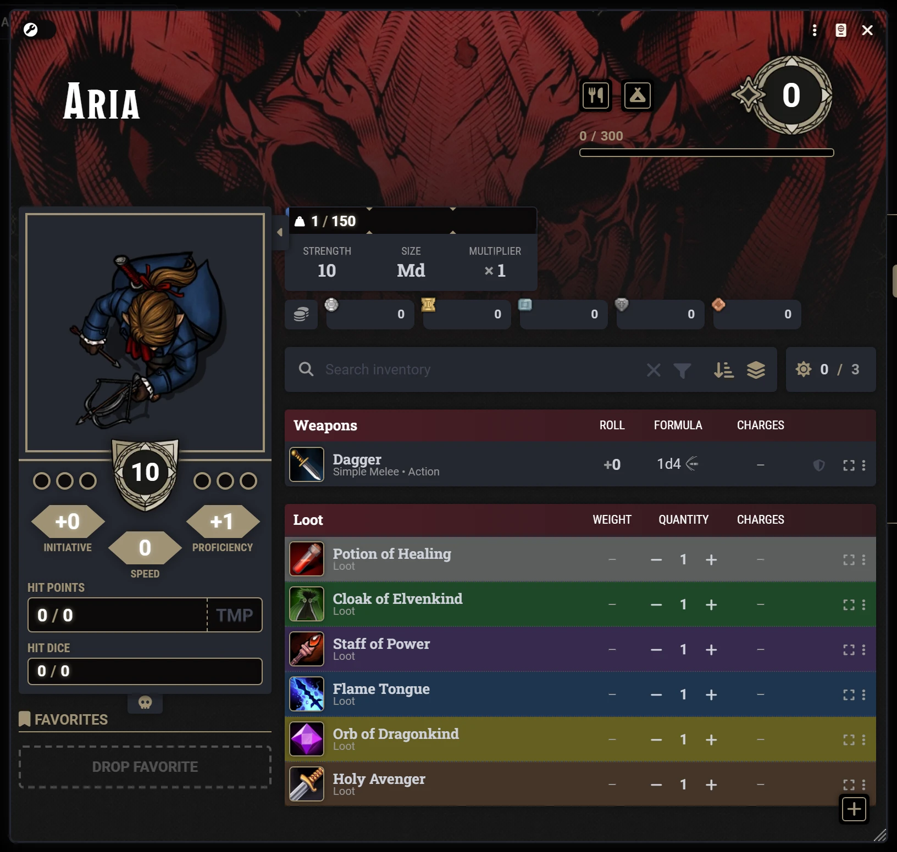

# Sogrom's Table Tools


[](https://github.com/IainFielding/Sogroms-Table-Tools/releases/latest)

**Hero Cards, cinematic rolls, and less work behind the screen for D&D 5e on Foundry VTT.**

Give your players more chances to be heroes without adding more for the GM to manage. This module enhances D&D 5e with Hero Cards, streamlined roll requests, and a host of gameplay improvements that keep the action flowing.




## Features

### Hero Cards

Hero Cards are twelve illustrated, once per longrest boons that let players turn defeat into victory, survive impossible odds, and pull off memorable last-minute saves. When a card can help, it's offered automatically, played directly from chat, and shown to the whole table.

- Play cards on existing rolls straight from chat.
- See only the cards that can affect the current roll.
- Celebrate every play with animated table-wide card reveals.

<table><tr>
<td></td>
<td></td>
</tr></table>

### Roll requests

Ask the whole table for rolls in seconds.

Whether you're running a skill challenge, resolving a chase, or calling for a dramatic group save, Roll Requests collect everyone's results in one place and keep the game moving.

- Six request types, from simple checks to team competitions and divine intervention.
- Offer multiple roll choices, each with its own DC.
- Hide DCs and results until the perfect moment for a reveal.
- Automatic death save requests when a dying character's turn begins.
- Macro-friendly API for custom encounters and automation.

<table><tr>
<td></td>
<td></td>
</tr></table>

### Enhanced Rolls

Give important rolls the spotlight they deserve. Critical successes and failures stand out instantly, feature dice can be applied directly from chat, and optional rules make natural 1s and 20s feel truly memorable.

- Natural 1s and 20s stand out with distinctive red and gold highlights.
- Critical save outcomes can deal maximum damage or avoid damage entirely.
- Add Bardic Inspiration, Cutting Words, and other feature dice directly from chat.


<table><tr>
<td></td>
<td></td>
</tr></table>

### Gameplay Enhancements

A collection of optional enhancements that that improve readability, reduce friction, and make everyday play smoother for both players and GMs. Enable only the features you want and tailor the experience to your table.

- Bloodied creatures are easier to spot at a glance.
- Unprepared spells are visually distinguished in spell lists.
- Item rarities are colour-coded throughout the sheet.



## Installation

In Foundry's setup screen, go to **Add-on Modules → Install Module**, and search for **Sogrom's Table Tools**, or paste
this manifest URL:

```
https://github.com/IainFielding/Sogroms-Table-Tools/releases/latest/download/module.json
```

Then enable it in your world's **Manage Modules**, and drag the **Hero Cards** feature from the
**Items (Sogrom's Table Tools)** compendium onto each character who should have them.

**Requires** Foundry VTT v14 and the D&D 5e system 6.x (tested on 6.0.5).

## Documentation

| Guide | For |
|---|---|
| **[Player Guide](docs/player.md)** | Playing Hero Cards, adding feature dice, Indomitable, and answering roll requests. |
| **[GM Guide](docs/gm.md)** | Setting up, every setting, running roll requests, and macros. |
| **[Developer Guide](docs/developer.md)** | The API, stored data, socket messages, code layout and tests. |
| **[Changelog](CHANGELOG.md)** | What's changed in each release. |

Found a bug or have an idea? [Open an issue](https://github.com/IainFielding/Sogroms-Table-Tools/issues/new/choose).
Want to help? See [CONTRIBUTING.md](CONTRIBUTING.md).

## Support

Sogrom's Table Tools is completely free. If it's added a little extra heroism to your table, consider 
[buying me a coffee on Ko-fi](https://ko-fi.com/sogrom).

## Credits

Inspired by D&D campaigns DM'd by [Captain RoBear](https://www.youtube.com/channel/UCktEYryPmattKzrpo0_kGzA). Sogrom's Table Tools is not affiliated with, or endorsed by Captain RoBear in any capacty.

The card art is made from images licensed from [Adobe Stock](https://stock.adobe.com) and [Pexels](https://www.pexels.com),
which remain the property of their creators. No AI-generated imagery is used. [docs/art-sources.md](docs/art-sources.md)
lists the source of each card. The Cinzel and Spectral fonts are under the SIL Open Font License (see `assets/fonts`).

Made by **Sogrom** ([@IainFielding](https://github.com/IainFielding)).

## Licence

Free for personal use. See [LICENSE](LICENSE).
