# RoBear-E

A [Foundry VTT](https://foundryvtt.com/) module for the **D&D 5e** system, made for the RoBear-E campaign. It adds
the **RoBear-E Cards**, a deck of one-use boons you can play on your rolls. It also adds a way for the GM to ask
the table for rolls, and some extra rules for rolls in chat.

This guide is for players. If you run the game, read the **[GM Guide](GM.md)** too. If you write macros or work on the
module, see the **[Developer Guide](DEVELOPER.md)**.

## Contents

- [Getting started](#getting-started)
- [The RoBear-E Cards](#the-robear-e-cards)
  - [Playing a card from your character sheet](#playing-a-card-from-your-character-sheet)
  - [Playing a card on a roll you've already made](#playing-a-card-on-a-roll-youve-already-made)
  - [What each card does](#what-each-card-does)
  - [Natural 1s and 20s](#natural-1s-and-20s)
- [Adding another feature's die to a roll](#adding-another-features-die-to-a-roll)
- [Fighter's Indomitable](#fighters-indomitable)
- [Answering the GM's roll requests](#answering-the-gms-roll-requests)

## Getting started

RoBear-E needs **Foundry VTT v14** and the **D&D 5e system 6.x** (tested on 6.0.5). Your GM installs and enables it, so
you don't have to do anything.

To have cards, your character needs the **RoBear-E Cards** feature. Your GM adds it from the **Items (RoBear-E)**
compendium. If you can't find it on your sheet, ask them.

## The RoBear-E Cards

Each card can be played once, and comes back after a long rest.

When anyone plays a card, its art appears in the middle of the screen for a moment, with the name of the character who
played it. Everyone who can see the roll it was played on sees the card. Click the card to dismiss it early.

### Playing a card from your character sheet

Click the **RoBear-E Cards** feature on your sheet. A window opens with every card you still have (spent cards aren't
shown). Click a card to play it.

The card is spent, and a short record of it goes to chat with the card's description folded away. Click the record's
header to read the description, or hover over the small card art to see it full size.

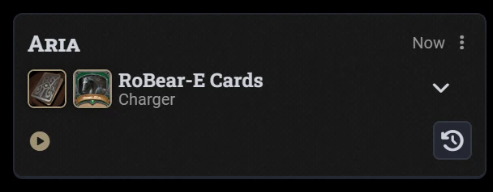

Playing **Advantage** this way gives you advantage on your next attack roll, ability check or saving throw.

> **Tip:** Shift-click the feature to get D&D 5e's standard list of uses instead.

### Playing a card on a roll you've already made

Your attack, damage, ability check, saving throw and initiative rolls get a **RoBear-E Card** button in chat.

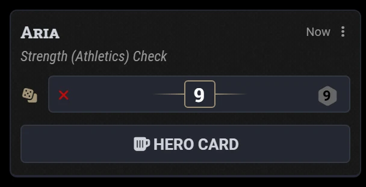

Click it to see the cards you can play on that roll. Cards that can't be played on it aren't offered.

Choose a card and the roll updates in place, so it keeps its spot in chat. It shows the new total, and works out hit or
miss against the target, or a save's success or failure, again. A note on the roll records which card was played and
what it changed.

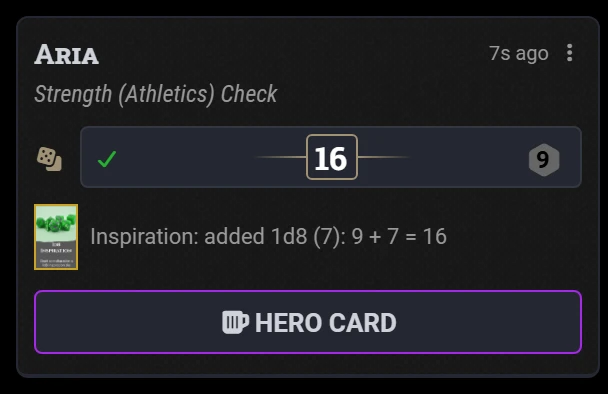

A few things to know:

- You can only play cards on your own rolls.
- Death saving throws can't be changed, because D&D 5e has already applied the result.
- Play a card on a damage roll **before** the damage is applied. Damage that has already been applied isn't changed.

### What each card does

| Card | What it does |
|---|---|
| **Inspiration + 1d6 / 1d8 / 1d10** | Adds the die to the roll. |
| **Luck** | Rerolls the dice, and you must use the new result. On a d20 roll it rerolls the d20 (or both d20s, with advantage or disadvantage); on a damage roll, all the damage dice. Can't be played on a natural 1 or 20. |
| **Advantage** | Rolls a second d20 and keeps the higher. On a roll with disadvantage, the two cancel out and it becomes a straight roll. Played from the sheet, it gives advantage on your next roll. |
| **Indomitable** | Rerolls a failed saving throw, and you must use the new result. Can't be played on a natural 1. |
| **Relentless** | Rerolls your initiative at the start of combat (in the first round), keeps the higher total, and updates the combat tracker. Can't be played on a natural 1. |
| **Charger**, **Reaction Surge**, **Extra Strike**, **Mind's Eye** | Played from the sheet. The card's text says what it lets you do; the module records that you played it, and you play out the effect at the table. |
| **Divine Intervention** | Played from the sheet. Its chat card has a button to roll its 1d100. Your GM may also call for it as a roll request: see [Divine Intervention](#divine-intervention). |

### Natural 1s and 20s

A natural 20 is ringed in gold in chat, and a natural 1 in red, on checks, saving throws and attacks alike. That
includes a save rolled from a spell's Save button, which D&D 5e shows inside the spell's card. Your GM can turn the
rings off with the **Ring natural 1s and 20s** setting.

- **A natural 1 is fixed.** Nothing rerolls it: not Luck, Indomitable or Relentless, and not the Fighter's Indomitable
  feature either.
- **By default, natural 1s and 20s lock the cards.** No card can be played on a roll whose d20 shows a natural 1 or
  20. Your GM can turn the lock off, which allows Advantage and Inspiration on them. Even then, Luck can't be played on
  a natural 20, and nothing rerolls a natural 1.
- Rolls without a d20, such as damage, aren't affected.
- **On a save against a spell's or feature's damage, a natural 20 takes no damage, and a natural 1 takes critical
  damage.** The critical damage is rolled for you alone, as a critical hit under your table's D&D 5e settings, and
  your resistances don't halve it. Your GM can turn this off with the **Natural 1s and 20s on saves against damage**
  setting, and can still change what you take before applying the damage.

## Adding another feature's die to a roll

Some features roll a die to change someone else's roll, such as **Bardic Inspiration** or **Cutting Words**. Roll the
die as usual. Then right-click its message in chat and choose **Add to a roll…** or **Subtract from a roll…**.

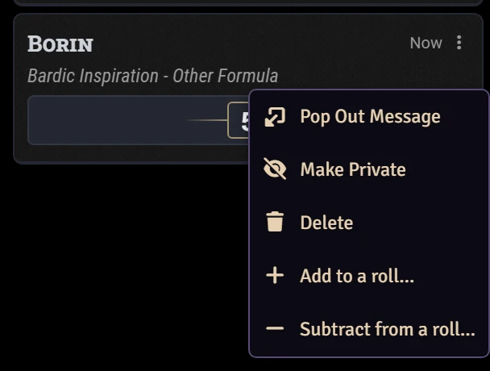

Pick the roll from the list, newest first.

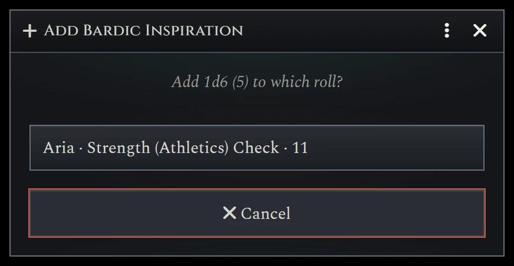

The die's total is added to that roll, or taken off it. The roll updates its total and, where it can, whether it hits
or saves. If the roll was made for a roll request, the request's card updates too. Both messages get a note, so
everyone can see where the die went.

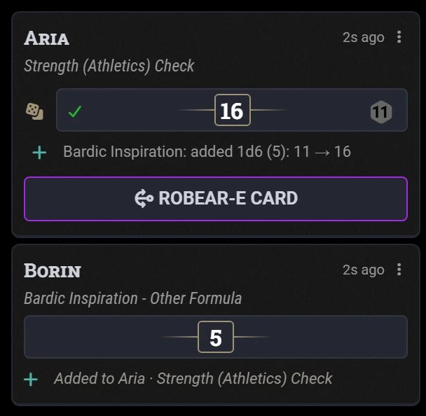

- A die can only be used once.
- Only the player who rolled the die can spend it, or the GM.
- You can choose any roll you can see. If it isn't yours to change, such as a monster's roll for Cutting Words, the
  GM's Foundry makes the change, so a GM needs to be logged in. If it can't be done, you're told, and the die isn't
  spent.
- Checks, saves, attacks and damage rolls can't be used as the die.

## Fighter's Indomitable

A Fighter with the **Indomitable** feature from D&D 5e's compendiums can use it on a saving throw they failed. A
**Use Indomitable** button appears on the failed save. It's also in the save's right-click menu.

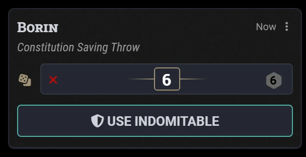

Using it spends one use of the feature and rerolls the d20, and the new roll stands. Under the 2024 rules the reroll
also adds your Fighter level; under the 2014 rules it doesn't. The save notes what happened:

- A natural 1 is fixed, so Indomitable isn't offered on one.
- On a save with no DC, it's offered whether or not you failed, and asks you to confirm before spending a use.
- If the reroll can't be saved, the use is given back.
- On a roll request whose result the GM hasn't shown yet, the button appears only once the GM shows it. Offering it
  sooner would tell you that you failed.

This is the class feature. The RoBear-E **Indomitable** card is separate, and you can use either.

## Answering the GM's roll requests

Sometimes the GM asks the table for rolls. A request card appears in chat, with a **Roll** button beside each of your
characters. Click it to make the roll. dnd5e's usual roll window opens, so advantage and your other options work as
normal.

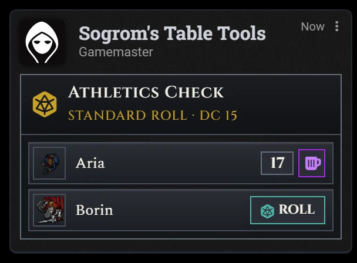

Once you've rolled, your result shows on the card. The anchor button beside it plays a RoBear-E Card on that roll.
Click the result itself to see its dice.

Things you may see on a request card:

- **DC ?** The GM is keeping the DC to themselves.
- **No success or failure yet.** The GM sees who passed straight away, and shows the table when they're ready.
- **Done**, in a Skill Challenge. You've finished your rolls, and the GM will show how you did.
- **?** in a Roll-Off against an NPC. The NPC's roll stays secret until the GM shows it.

### Choosing which roll to make

The GM may let you choose between several rolls, such as Athletics or Acrobatics. The card then lists them all, and
clicking **Roll** asks which one you want to make. Each choice can have its own DC, so the easier roll may be the one
with the harder DC. You see each DC unless the GM is keeping it hidden.

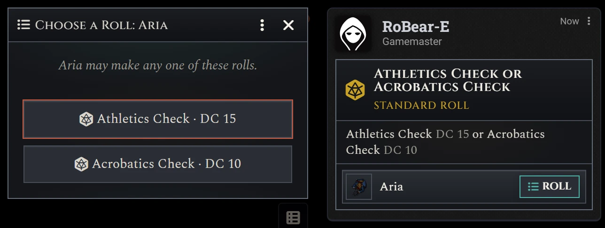

### Divine Intervention

In a Divine Intervention request, clicking **Roll** first asks you to pick a run of numbers from 1 to 100. Hover over a
number to preview the run that starts there, and click to pick it. Then roll the d100: you need to roll one of your
numbers.

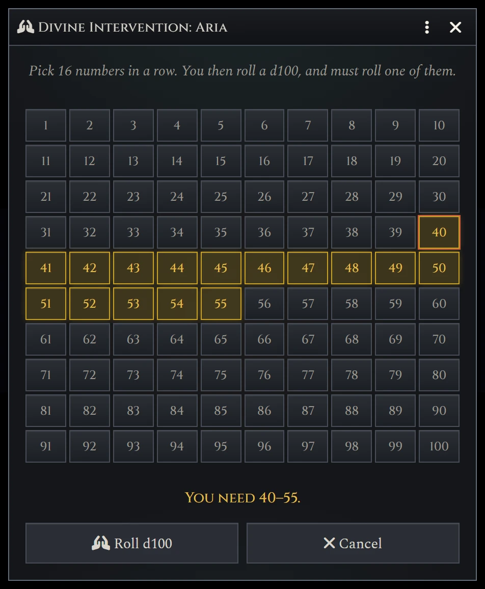

The **Advantage** card rolls a second d100 and keeps whichever lands in your numbers, and **Luck** rerolls the d100.

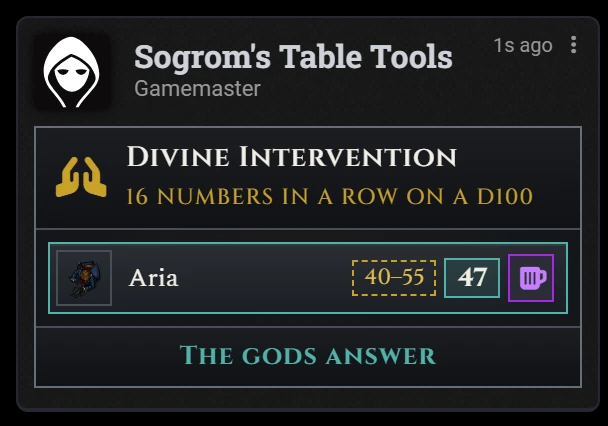

### Pop-up windows

Your GM may have requests pop up in a window, with a **Roll** button for each of your characters in it. The window
closes once everything in it is rolled, and the chat card works as well. If you join the game within 30 minutes of a
request you still need to roll for, its window opens for you then.

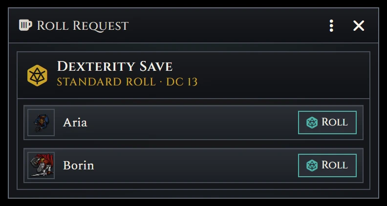

### Rolling again

You can't delete a roll you made for a request, so a bad roll can't be thrown away. If the GM lets you roll again,
they remove your roll from the card, and your **Roll** button comes back.

## Credits

The card art is the work of [Captain RoBear](https://www.youtube.com/channel/UCktEYryPmattKzrpo0_kGzA) and remains
the property of its creator. The Cinzel and Spectral fonts are under the SIL Open Font License (see `assets/fonts`).

## Author

- **Sogrom** ([@IainFielding](https://github.com/IainFielding))

## License

Free for personal use. See [LICENSE](LICENSE).
