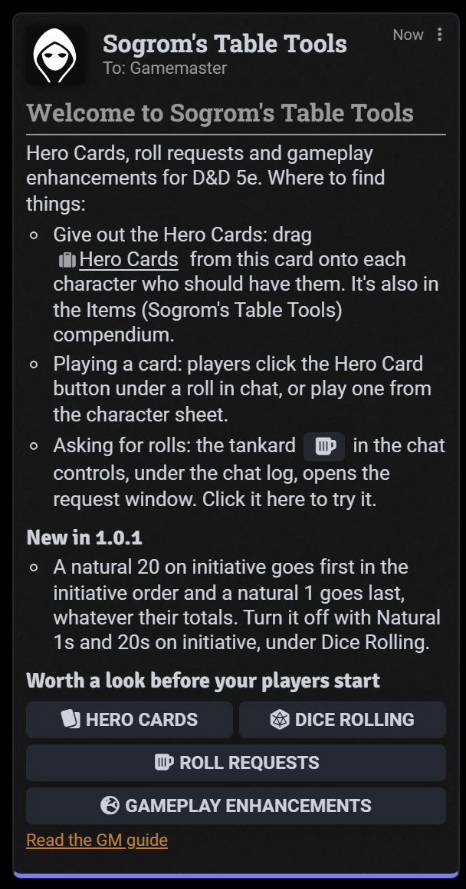
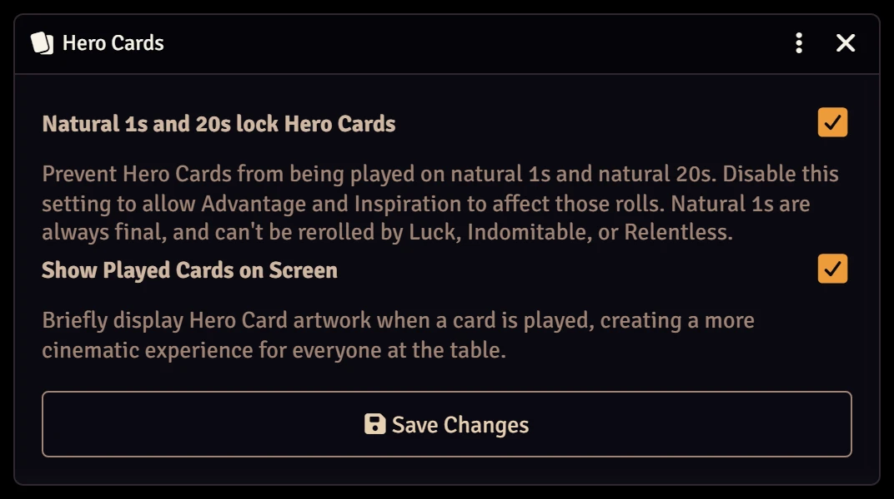
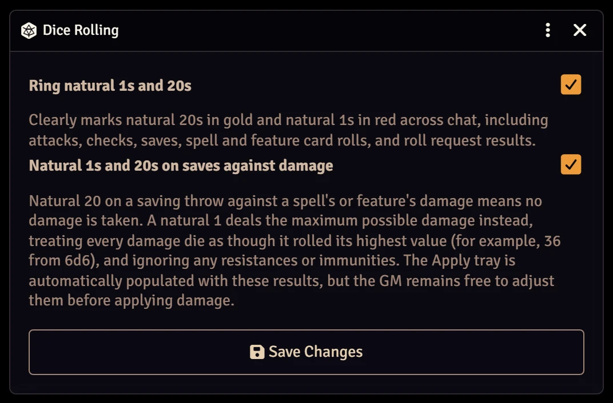
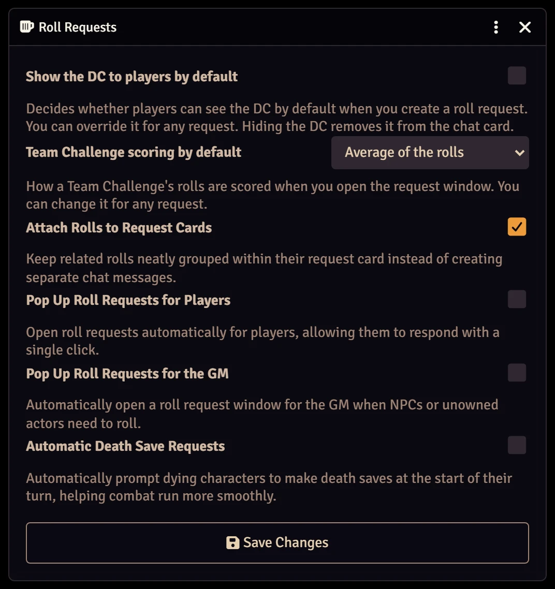
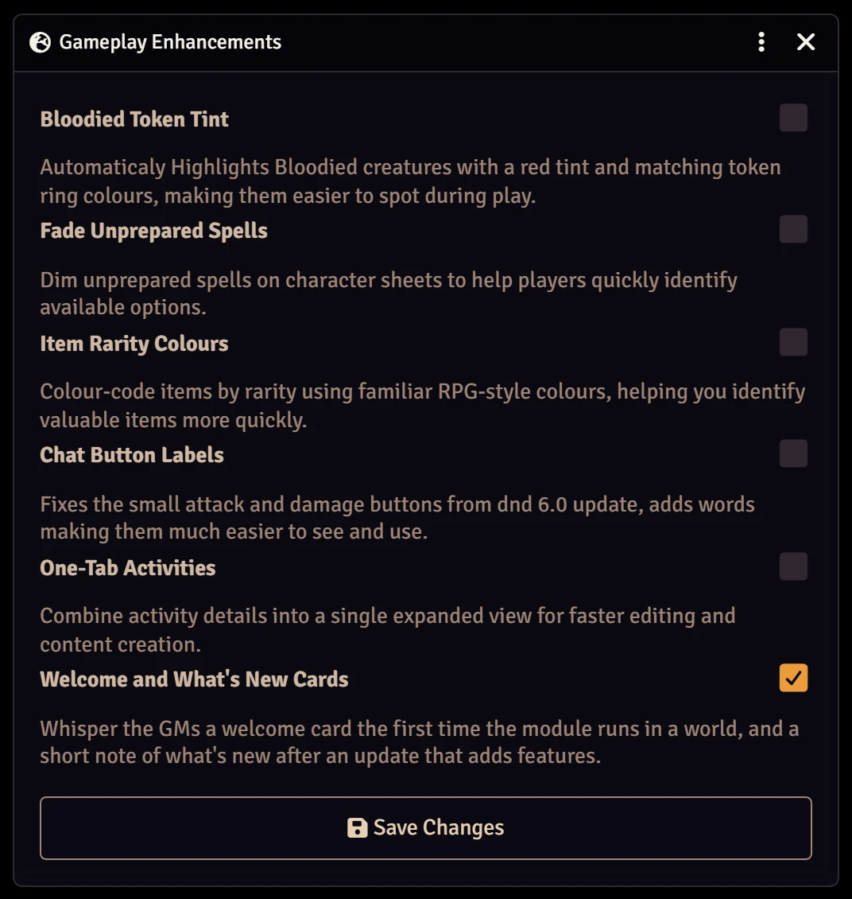
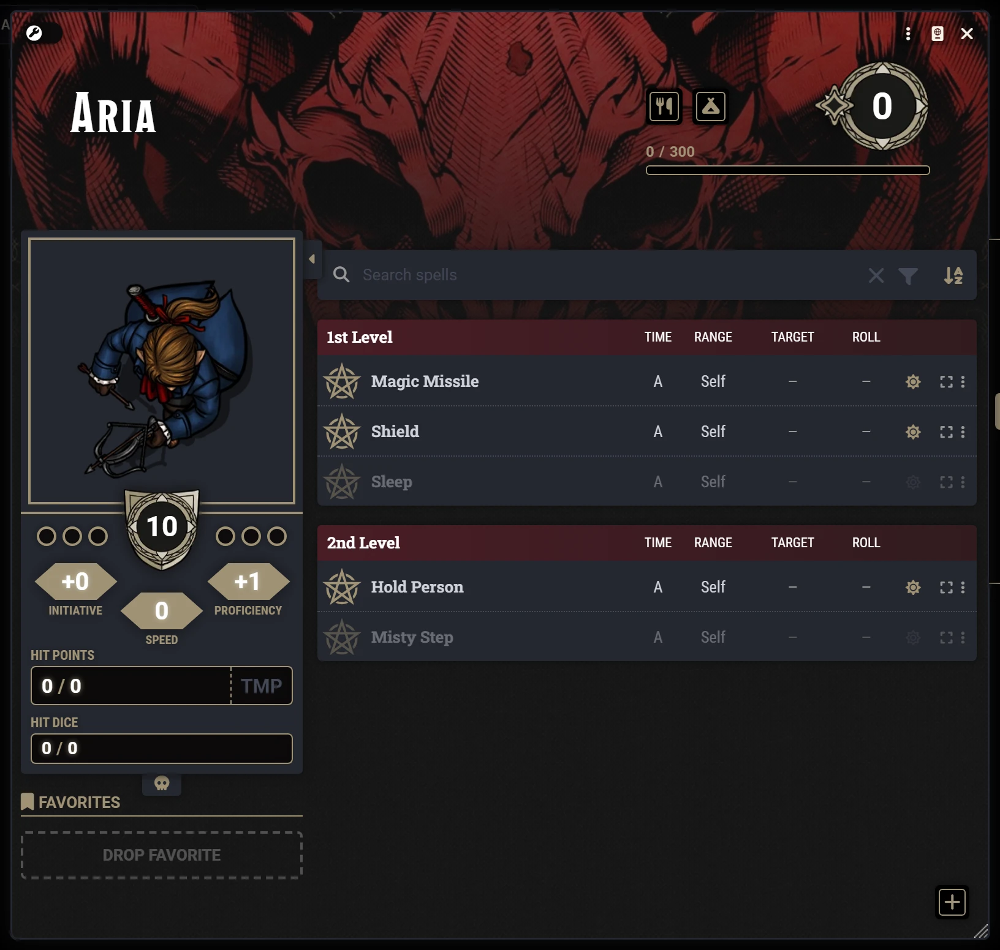
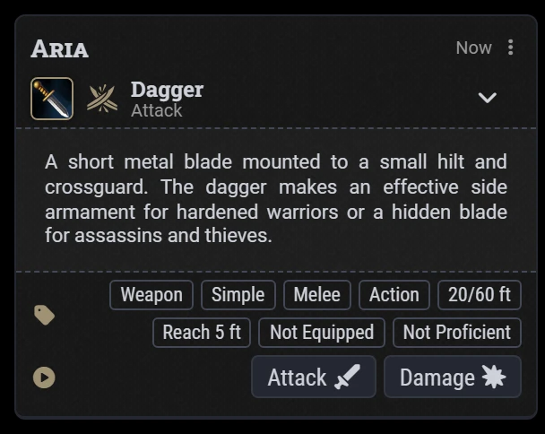
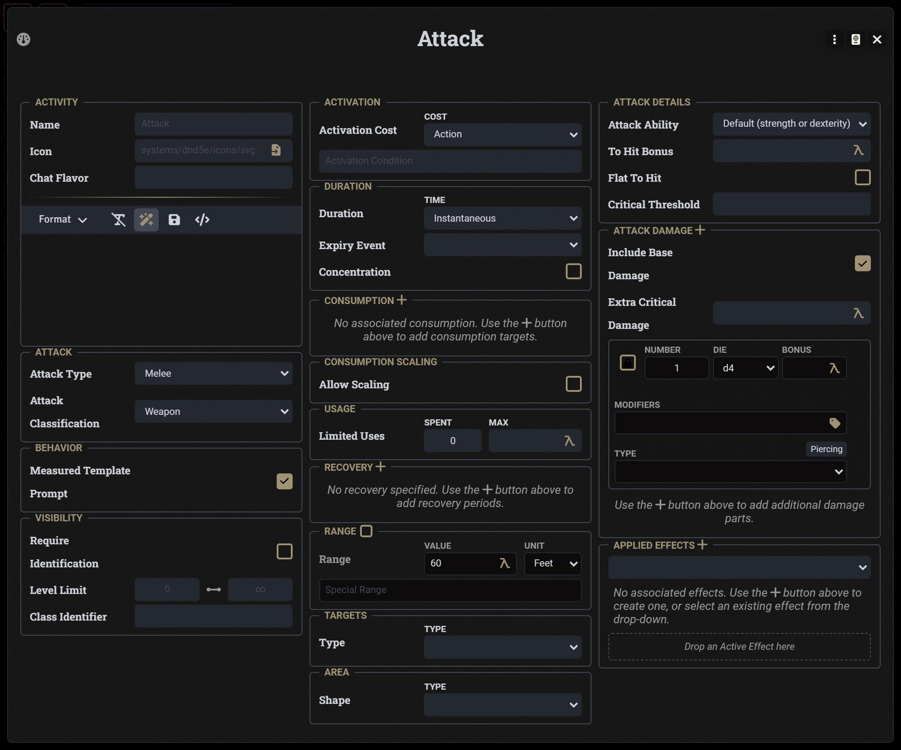
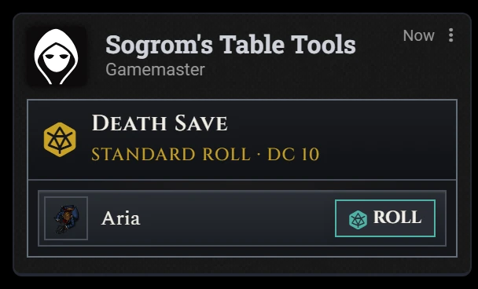

# Sogrom's Table Tools: GM Guide

This guide is for the GM. It covers setting Sogrom's Table Tools up, the settings, and asking the table for rolls. What players
see and do, including how the Hero Cards work, is in the [player guide](player.md). Read that first: as GM you
can do everything a player can.

## Contents

- [Setting up](#setting-up)
- [Settings](#settings)
- [Asking for rolls](#asking-for-rolls)
  - [The request window](#the-request-window)
  - [Kinds of request](#kinds-of-request)
  - [Running a request](#running-a-request)
  - [Who can roll, and rolling again](#who-can-roll-and-rolling-again)
  - [Private rolls and what "hidden" means](#private-rolls-and-what-hidden-means)
  - [Pop-ups](#pop-ups)
  - [Death saves](#death-saves)
- [Cards and dice at the table](#cards-and-dice-at-the-table)
- [Other modules](#other-modules)
- [Macros](#macros)

## Setting up

1. **Install.** In Foundry's setup screen, go to **Add-on Modules → Install Module**. Search for "Sogrom's Table Tools" or paste
   the manifest URL:
   `https://github.com/IainFielding/Sogroms-Table-Tools/releases/latest/download/module.json`
2. **Enable** Sogrom's Table Tools in your world's **Manage Modules**. It needs Foundry VTT v14 and D&D 5e 6.x (tested on 6.0.5).
3. **Give out the cards.** Drag the **Hero Cards** feature from the **Items (Sogrom's Table Tools)** compendium onto each
   character who should have them. Each card is an activity on that feature with one use, recovered on a long rest.
   To give a card back early, reset its uses on the character sheet.

The first time the module runs in a world, you're whispered a welcome card: where things are, what's new, and a
button for each group of settings. Drag its **Hero Cards** link onto a character to give them the cards, and click its
tankard to open the request window. After an update that adds features, you get a short note of what's new instead.
A patch release says nothing. Turn the cards off with **Welcome and What's New Cards**, under
[Gameplay Enhancements](#gameplay-enhancements).



The compendiums sit in a **Sogrom's Table Tools** folder in the Compendium sidebar. Players can view them.

| Compendium | What's in it |
|---|---|
| **Journal (Sogrom's Table Tools)** | **Artwork**: the art of every card, and the campaign art. **Spell Lists**: a class spell list for each spellcasting class, registered with D&D 5e. |
| **Items (Sogrom's Table Tools)** | The **Hero Cards** feature, the **Belts of Phoenix Dexterity**, and **Corn Liquor**. |
| **Spells (Sogrom's Table Tools)** | **Theodore's Morning Coffee**. |

## Settings

In **Game Settings → Configure Settings → Sogrom's Table Tools**, the settings are grouped behind four buttons:
**Hero Cards**, **Dice Rolling**, **Roll Requests** and **Gameplay Enhancements**. Each opens a window with that group's settings. Only a GM
can open them, and each setting applies to the whole world.


### Hero Cards



| Setting | Default | What it does |
|---|---|---|
| **Natural 1s and 20s lock Hero Cards** | On | No card can be played on a roll whose d20 shows a natural 1 or 20. Turn it off to allow Advantage and Inspiration on them. Either way, Lucky can't be played on a natural 20, and nothing rerolls a natural 1. |
| **Show played cards on screen** | On | A played card's art appears in the middle of the screen for everyone who can see the roll. Chat keeps a record either way. |

### Dice Rolling



| Setting | Default | What it does |
|---|---|---|
| **Ring natural 1s and 20s** | On | A roll whose d20 shows a natural 20 is ringed in gold in chat, and a natural 1 in red: checks, saving throws and attacks, a save summarised inside the card of the spell that called for it, and a result on a request card. Turn it off for plain totals. |
| **Natural 1s and 20s on saves against damage** | On | When a spell or feature calls for a save and deals damage, a natural 20 on the save takes no damage, and a natural 1 takes the damage's maximum, every die at its highest (36 from 6d6), ignoring resistances and immunities. Each starts that way in the damage's **Apply** tray, where you can still change it. Turn it off for D&D 5e's own rules. |

### Roll Requests



| Setting | Default | What it does |
|---|---|---|
| **DC by default** | Blank | The DC each roll starts with when you open the request window. Leave it blank for none; you can still set or change the DC for each request, or later from the card. |
| **Show the DC to players by default** | Off | Whether **Show DC to Players** starts ticked in the request window. You can still change it for each request. |
| **Team Challenge scoring by default** | Average of the rolls | How a Team Challenge is scored when you open the request window. You can still change it for each request. See [Team Challenge](#team-challenge). |
| **Attach rolls to the request card** | On | The rolls made for a request show on its card rather than as messages of their own, as D&D 5e does for an item's saves. Click a result to see its dice. |
| **Pop up roll requests for players** | Off | Opens a window for each player with a character in a request, with a Roll button for each of their characters. |
| **Pop up roll requests for the GM** | Off | Opens a window for you when a request includes NPCs, or any actor no player owns. |
| **Ask for death saves** | Off | Posts a death save request at the start of a dying character's turn in combat. See [Death saves](#death-saves). |

### Gameplay Enhancements

Optional changes to tokens and actor sheets. Each is off until you turn it on. The window also holds **Welcome and
What's New Cards**, which starts on.



| Setting | Default | What it does |
|---|---|---|
| **Bloodied Token Tint** | Off | When D&D 5e marks a creature Bloodied, its token is tinted red and its token ring's background turns red. A token that's already Bloodied when you turn this on changes the next time it becomes Bloodied. |
| **Fade Unprepared Spells** | Off | On actor sheets, spells of level 1 or higher that could be prepared but aren't are faded. Cantrips, always-prepared spells, and spells from items or at-will and innate sections stay as they are. |
| **Chat Button Labels** | Off | On compact chat cards, each icon button shows its name beside its icon, so you don't have to hover over it to see what it does. |
| **One-Tab Activities** | Off | An activity's **Identity**, **Activation** and **Effect** tabs are laid out side by side in one wide window, without their hints. Handy when you're making a lot of content. |
| **Item Rarity Colours** | Off | Tints each item row on actor sheets by its rarity: green for uncommon, blue for rare, purple for very rare, orange for legendary and gold for artifact. |
| **Welcome and What's New Cards** | On | Whispers the GMs a welcome card the first time the module runs in a world, and a short note of what's new after an update that adds features. See [Setting up](#setting-up). |

<table><tr>
<td></td>
<td></td>
</tr></table>





## Asking for rolls

Open the request window from the **tankard** button in the chat controls, under the chat log:


When the chat sidebar is closed, use **Request Rolls** in the token controls instead. Only a GM sees these
buttons.

### The request window


1. **Kind of roll.** Pick one of the six kinds described below. The fields below change to suit it, and anything
   you've filled in carries over when you switch.
2. **Rolls.** Choose the roll: a plain die (a d20 by default, or a d6, d8, d10, d12 or d100), any skill or tool check,
   ability check, or saving throw. The DC starts blank each time you open the window, or as the **DC by default**
   setting if you've set one: set one, or leave it blank for none and set it later from the card. A Skill Challenge, and a Team Challenge not scored by its average, need
   one before you can send them.
3. **Who rolls.** The actors of any tokens you have selected are ticked for you; otherwise the player characters
   are. The list offers the selected tokens, the player characters, the members of your groups, the combatants, and
   the tokens on the current scene. The tick button beside the heading selects them all.

   Above the list, **quick picks** tick a whole group in one click, and untick it if it's all ticked already:

   | Quick pick | Who it ticks |
   |---|---|
   | Your party's name | The members of D&D 5e's primary party. Each of your other group actors gets a pick of its own, by its name. |
   | **Combat: everyone** | Everyone in the current combat. Each unlinked token rolls for itself. |
   | **Combat: hostile** | The combatants whose tokens are hostile, for when only the monsters need to roll. |
   | **Selected tokens** | The tokens you have selected now, even ones selected after you opened the window. |
   | **Everyone on scene** | Every token on the scene you're viewing. |

   A pick only shows when there's someone in it, and it's highlighted while all of its members are ticked. In Team vs
   Team, each side has its own picks, and ticking a group for one side takes its members off the other. When a combat
   is running and no NPCs are selected, the NPCs' side starts with the hostile combatants.
4. **Options.**
   - **Show DC to Players.** Unticked, players see "DC ?" on the card, and the DC is kept off their rolls so D&D 5e
     doesn't show them success or failure.
   - **Roll Visibility.** **Public**, or **Private GM Roll**, where each player sees only their own results.
5. **Send Request** posts the request to chat.

**Offering a choice of rolls.** In a Standard Roll, Team Challenge or Skill Challenge, click **+** beside a roll to
let each actor make a different roll instead, such as Athletics or Acrobatics, or Persuasion or Deception. You can
offer up to four rolls. When a player clicks **Roll**, they're asked which one to make. Hover over a result on the card
to see which they chose.

In a Standard Roll or Skill Challenge, each choice has a DC of its own, so an easier roll can have a harder DC: for
example, Athletics at DC 15 or Acrobatics at DC 10. A new choice starts with the roll's DC. In a Team Challenge,
the choices share one DC, because the rolls are averaged against it.


The card lists each choice with its DC, and you can click any of them to change it. Players see each DC on the card
and on the buttons they choose from, or "DC ?" if you're keeping the DC hidden.

### Kinds of request

#### Standard Roll

Each actor rolls once against the DC. You see straight away who passed and how many succeeded. Players don't, until
you click **Show to players**, and you can hide it again.

<table>
<tr><th>What you see</th><th>What players see</th></tr>
<tr>
<td></td>
<td></td>
</tr>
</table>

Once you show it:


#### Skill Challenge

Three rolls in turn, each with its own roll and DC. Choose how many successes are needed (2 of 3 by default). An
actor stops rolling as soon as they have passed or failed. Only you see who passed until you click **Show to
players**; players see "Done" once they have finished.


#### Team Challenge

Everyone rolls, and the team gets one result. Choose how it's worked out under **Scoring**:

| Scoring | How the team's result is worked out |
|---|---|
| **Average of the rolls** | The average, rounded down, is compared to the DC. Each natural 1 removes the highest roll from the pool, and each natural 20 removes the lowest. If that would leave no rolls, 1s and 20s cancel out in pairs, and at least one roll always stays. Hover over a removed roll to see why it was removed. |
| **Half must succeed** | The group check from the Player's Handbook: if at least half the team meets the DC, the whole team succeeds. |
| **Leader, helped by the rest** | The roll with the highest modifier counts, +1 for each other roll that meets the DC and −1 for each that doesn't. |
| **Weakest link** | The roll with the lowest modifier counts, +1 for each other roll that meets the DC. Other failures don't count against it. |

All but the average are judged against the DC, so they need one. A roll's modifier is its total less the d20 it kept,
so where you offer a choice of rolls, such as Athletics or Acrobatics, each actor is judged by the roll they chose. On
a tie, the higher total counts. The card marks each roll with what it did for the team (**Leader**, **+1**, **−1**),
and its summary shows the working, such as "Aria leads: 21, +1 helped, −2 hindered = 20".

Only you see the result until you click **Show to players**. A Hero Card played on a roll, or a changed DC, scores the
team again, so playing Inspiration on a helper can make them the leader.


#### Roll-Off

One actor against another, player characters or NPCs. Pick a **Challenger** and an **Opponent**, and a roll for each:
a d20 (the default), a d6, d8, d10, d12 or d100, or any check, save or tool. The higher total wins; an equal total is a
tie.


An NPC's roll is a private GM roll: players see "?" until you click **Show NPC roll** on the card, and you can hide it
again.

<table>
<tr><th>What you see</th><th>What players see</th></tr>
<tr>
<td></td>
<td></td>
</tr>
</table>

#### Team vs Team

Pick a **Players** team and an **NPCs** team, and a roll for each (a d20 by default, or any check, save or tool). Each
team's rolls are pooled like a Team Challenge, natural 1s and 20s included, and the higher average wins. The averages
are rounded down to one decimal place, so 12.6 beats 12.3; only averages equal to that place tie.

As in a Roll-Off, each NPC's roll is a private GM roll: players see "?" for the NPCs, and no winner, until you click
**Show NPC rolls** on the card, and you can hide them again.


#### Divine Intervention

Choose the one character who prays, and set how many numbers they pick, from 1 to 50 (16 by default). When the
player clicks **Roll**, they pick that many numbers in a row from 1 to 100, then roll a d100, and must roll one of
their numbers. The **Advantage** card rolls a second d100 and keeps whichever lands in their numbers, and **Lucky**
rerolls the d100.

When a player plays the **Divine Intervention** card from their sheet, you're whispered a note with a **Set Up Divine
Intervention** button. It opens this window set to Divine Intervention, with that player's character the one to
roll. Set the numbers to pick, and send it when you're ready.


### Running a request

**Rolling for NPCs.** Every row has a **Roll** button for you, so you can roll for anyone, including NPCs.

**Changing the DC.** On a Standard Roll, Team Challenge or Skill Challenge card, click the DC to change it, or clear
it for no DC (each Skill Challenge roll must keep one, as must a Team Challenge not scored by its average). Where each choice has its own DC, click the one to change.
Rolls already made are scored again against the new DC.


**Cards on requested rolls.** Requested rolls are ordinary D&D 5e rolls, so players can play Hero Cards on them,
from the tankard button beside their result. The card updates as soon as a card changes a roll.

**Attached rolls.** With **Attach rolls to the request card** on (the default), the rolls don't get chat messages of
their own. Click a result to see its dice. Notes on any cards played show under the row.

### Who can roll, and rolling again

- A roll only counts if it was made by you or by one of the actor's owners.
- If the same roll is made twice, such as by you and a player clicking **Roll** at the same moment, the first one
  counts.
- **To let someone roll again,** click their result on the card to open its dice, then click **Roll again** and
  confirm. Their roll is deleted and their **Roll** button comes back. A card played on that roll stays spent. With
  **Attach rolls to the request card** off, you can also delete the roll's own chat message. Players can't delete a
  roll made for a request, so they can't throw away a bad roll.


### Private rolls and what "hidden" means

- With **Private GM Roll**, each player sees only their own results. In a private Roll-Off or Team vs Team, **Show NPC roll**
  (or **Show NPC rolls**) shows the NPCs' rolls only to the players in the request, not to everyone.
- **Hidden isn't secret.** The DC, and results you haven't shown yet, are hidden on the chat card, but they still
  reach every player's Foundry as part of the request. A player who opens the browser console can read them. That's
  how Foundry shares chat messages, so the hiding keeps the table honest rather than keeping a secret.

### Pop-ups

Two settings, both off by default, open a window when a request is posted:

- **Pop up roll requests for players** gives each player a window with a **Roll** button for each of their
  characters in the request. A player who joins within 30 minutes of a request they still need to roll for gets its
  window then.
- **Pop up roll requests for the GM** does the same for you, for NPCs and any other actor no player owns.


Each window closes once everything in it is rolled. The chat card works either way.

### Death saves

With **Ask for death saves** on, a **Death Save** request is posted at the start of a creature's turn in combat if it's
at 0 hit points and dying. It's an ordinary request, for that one creature, so it opens a pop-up under the two settings
above: the player's window for their character, and yours only for a creature no player owns. You can always roll it
from the chat card.



- **Who is asked.** Characters, and NPCs marked **Important** on their sheet, as D&D 5e shows death saves for. A
  creature that is defeated in the combat tracker, dead, or stable isn't asked.
- **The result shows at once.** A death save's result goes onto the sheet as soon as it's rolled, so the card shows
  pass or fail, against DC 10, without waiting for **Show to players**.
- **Stable.** After a third success D&D 5e clears the creature's successes but leaves it at 0 hit points, so Sogrom's
  Table Tools notes that it's stable and stops asking. It's asked again once it takes a failure (mark one on its
  sheet when it's hurt at 0 hit points: D&D 5e doesn't) or after it's been healed and drops again. The **Stable**
  condition stops the requests too.
- **Healed before rolling.** If the creature is healed before its death save is rolled, the request is removed and its
  pop-ups close.
- **Once a round.** Going back a turn and forward again doesn't post a second request for the same round.

## Cards and dice at the table

- **You can play cards for players.** As GM you can open the card chooser on any roll by a character who holds
  Hero Cards, and play one for them.
- **Bonus dice need a GM online.** When a player adds a die such as Bardic Inspiration to a roll that isn't theirs,
  such as a monster's roll for Cutting Words, your Foundry makes the change. If no GM is logged in, or your Foundry
  can't make it, the player is told and the die isn't spent.
- **Indomitable waits for you.** On a request whose result you haven't shown, Indomitable (the card or the Fighter
  feature) is only offered once you click **Show to players**, so it doesn't give away who failed.
- **Natural 1s and 20s.** The lock is a world setting: see [Settings](#settings).

## Other modules

Sogrom's Table Tools works alongside modules that change how D&D 5e rolls and shows its chat cards:

- **RSReforged.** Its quick rolls draw an activity's attack, damage and formula rolls inside the activity's card. The
  Hero Card button, notes on cards played, and natural 1 and 20 rings appear there, and a feature's die shown there,
  such as Bardic Inspiration, can be added to a roll from the card's right-click menu. Damage applied with
  RSReforged's own Apply buttons follows **Natural 1s and 20s on saves against damage**. RSReforged swaps Shift on a
  Roll button: a plain click rolls straight away, and Shift-click opens the roll window.
- **Midi-QOL: partly supported.** Using the Hero Cards feature from the sheet opens the card chooser, as it does
  without Midi. When Midi rolls the saves and applies a spell's damage itself, a natural 20 on the save takes no damage
  and a natural 1 takes the damage's maximum past resistances and immunities, following **Natural 1s and 20s on saves
  against damage**. A feature's die that Midi shows on the feature's card, such as Bardic Inspiration, can be added to
  a roll from the card's right-click menu. Natural 1s and 20s on the saves Midi lists on its card are ringed.

  What isn't supported: a card played after Midi has resolved a roll changes the roll in chat, but not the hits,
  saves or damage Midi has already worked out and applied. If you want cards to decide outcomes, set Midi's hit
  checking and damage application to manual, so the card can be played before the result is applied.

## Macros

A macro can open the request window, or post a request without it:

```js
const tools = game.modules.get("sogrom-table-tools").api;

// Open the request window, as the tankard button does.
tools.requestRolls();

// Open it on a Team Challenge, with the combat's hostile combatants ticked.
tools.requestRolls({ mode: "team", group: "hostile" });

// Ask the party's player characters for a DC 15 Athletics check.
const party = game.actors.filter(a => a.hasPlayerOwner && (a.type === "character"));
await tools.createRequest({
  mode: "standard",
  parts: [{ type: "skill", key: "ath", dc: 15 }],
  actors: party.map(a => a.uuid)
});
```

Anything the macro leaves out is filled in as the window would fill it. A request that can't be rolled, such as one
naming a skill D&D 5e doesn't know, is refused with a message saying why. The
[Developer Guide](developer.md#the-api) describes every option, with an example for each kind of request.
